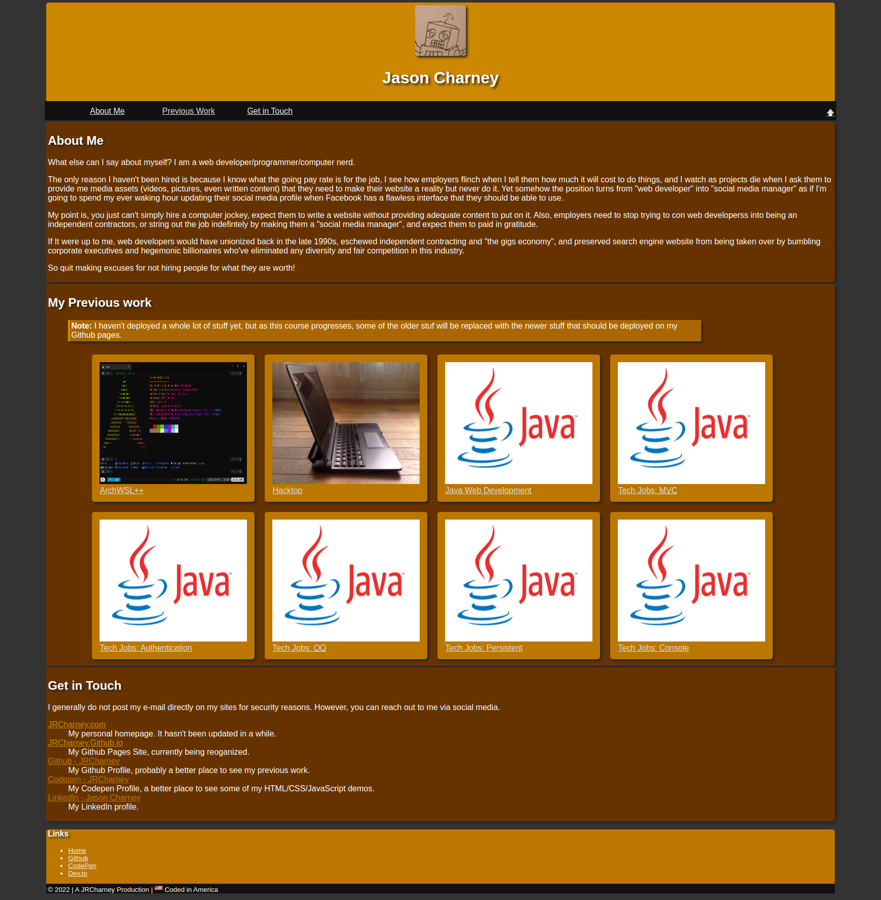

# bootcamp-portfolio
Module 2 Challenge



## Your Task
Welcome to this week's Challenge! This is an even-numbered week, so you won't be given any starter code. Instead, you'll create a web application from scratch! This week, you'll build a portfolio page, which you can add to as the course progresses.

A portfolio of work can showcase your skills and talents to employers looking to fill a part-time or full-time position. An effective portfolio highlights your strongest work as well as the thought processes behind it. Students who have portfolios with deployed web applications (meaning they are live on the web) are typically very successful in their career search after the boot camp. This last point can’t be stressed enough: having several deployed projects is a minimum requirement to receive an initial interview at many companies.

With these points in mind, in this Challenge you’ll set yourself up for future success by applying the core skills you've recently learned: flexbox, media queries, and CSS variables. You'll get to practice your new skills while creating something that you will use during your job search. It’s a win-win that you'll likely be grateful for in the future!

Note: If you don't have enough web applications to showcase at this point, use placeholder images and names. You can change them to real applications as you create them later in the course.

Let’s take a look at what a user story written from the perspective of a hiring manager might look like. As you might remember from your first Challenge, we follow the AS AN / I WANT / SO THAT format.

## User Story

```
AS AN employer
I WANT to view a potential employee's deployed portfolio of work samples
SO THAT I can review samples of their work and assess whether they're a good candidate for an open position
```

## Acceptance Criteria
Here are the critical requirements necessary to develop a portfolio that satisfies a typical hiring manager’s needs:

```
GIVEN I need to sample a potential employee's previous work
WHEN I load their portfolio
THEN I am presented with the developer's name, a recent photo or avatar, and links to sections about them, their work, and how to contact them
WHEN I click one of the links in the navigation
THEN the UI scrolls to the corresponding section
WHEN I click on the link to the section about their work
THEN the UI scrolls to a section with titled images of the developer's applications
WHEN I am presented with the developer's first application
THEN that application's image should be larger in size than the others
WHEN I click on the images of the applications
THEN I am taken to that deployed application
WHEN I resize the page or view the site on various screens and devices
THEN I am presented with a responsive layout that adapts to my viewport
```

## TODO List

* [x] Create a page with the following items.
    * [x] Name
    * [x] A recent photo or avatar
    * [x] Links to sections about them, their work, and how to contact them
* [x] Create a `<nav>` section with links that scroll down to the corresponding section. 
* [x] Create a link that scrolls down to the section about their work, where the work section has titled images of their previous applications. (This requires some JavaScript.)
  - Use `position: sticky`, not `position:fixed`, to make it work! 
* [x] On mouseover of a project's image, enlargen the image larger than the other images.
    - Turns out this was a lot more easier that I thought. See [this](https://css-tricks.com/snippets/css/scale-on-hover-with-webkit-transition/).
* [x] On click of a project's image, go to that deployed application's page. (`<a href="...">...</a>`)
  - Currently I don't have a whole lot deployed, so I just linked to the github repos.
* [ ] **Apply responsive web design (RWD) to the page's design.** (What sizes?)
* [x] Add a screenshot of this project

## Extras

Though it wasn't part of the assignment, I snuck in some extra goodies. Try to find where I put them. ;)
